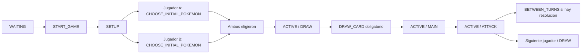
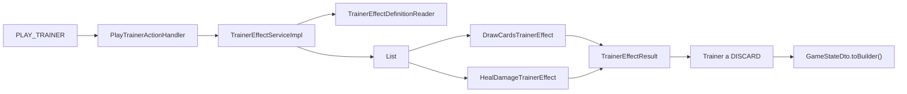
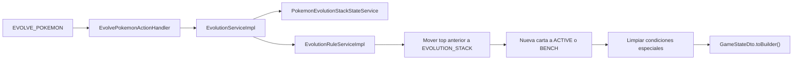
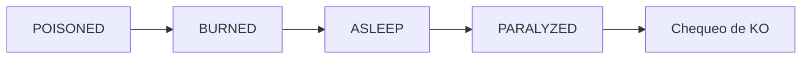
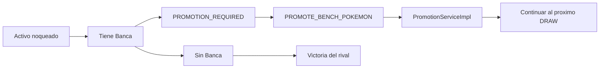

# Arquitectura del Motor de Juego

Este documento describe el estado actual del motor de juego de Pokemon TCG en el backend. Cubre el modelo basado en acciones, el estado inmutable, el setup inicial, el flujo de turnos, las acciones principales, la evolucion, el combate, la resolucion de knockouts, los premios y las reglas tecnicas que deben respetarse al extender la Persona 5.

El motor vive principalmente bajo `ar.edu.utn.frc.tup.piii.services.game` y esta organizado por dominio funcional. El estado publico se expone mediante DTOs en `ar.edu.utn.frc.tup.piii.dtos.game`.

## 1. Vision General

El motor es una capa de aplicacion basada en acciones. El cliente envia un `GameActionRequestDto` con un `GameActionType`, y el backend transforma esa accion en validaciones, cambios de dominio, snapshots, logs y eventos realtime.

La entrada principal es `GameServiceImpl`, que implementa el contrato `GameService`. Esta clase no contiene reglas concretas de Pokemon TCG; su responsabilidad es orquestar el flujo de ejecucion:

1. Verifica que el usuario sea participante mediante `GameLookupService`.
2. Obtiene el estado visible con `GameSnapshotService` o reconstruye el estado con `GameStateQueryService`.
3. Valida la version esperada del estado.
4. Crea un `GameActionContext`.
5. Ejecuta el pipeline de validacion con `RuleValidator`.
6. Ejecuta la accion concreta con `GameActionExecutor`.
7. Restaura entidades desde el `GameStateDto` resultante con `GameStateRestorer`.
8. Persiste el nuevo snapshot con `GameSnapshotService`.
9. Registra la accion con `GameActionLogger`.
10. Publica eventos por `GameRealtimeEventService`.

```mermaid
flowchart LR
    Controller["Controller"] --> GameService["GameServiceImpl"]
    GameService --> State["GameSnapshotService / GameStateQueryService"]
    State --> Context["GameActionContext"]
    Context --> RuleValidator["RuleValidatorImpl"]
    RuleValidator --> Validators["ActionValidator ordenados"]
    Validators --> Executor["GameActionExecutorImpl"]
    Executor --> Handler["GameActionHandler"]
    Handler --> FeatureService["Servicio de dominio"]
    FeatureService --> Result["GameActionExecutionResult"]
    Result --> Restore["GameStateRestorer"]
    Restore --> Snapshot["GameSnapshotService"]
    Snapshot --> Events["GameRealtimeEventService"]
```



### Contratos centrales

`GameService` es el puerto publico para ejecutar acciones.

`GameActionContext` agrupa `gameId`, `actorUserId`, `GameActionRequestDto` y el `GameStateDto` actual. Evita que cada handler vuelva a resolver el mismo contexto.

`RuleValidator` ejecuta todos los `ActionValidator` registrados por Spring respetando `@Order`. Las validaciones globales y por feature se mantienen pequenas.

`GameActionExecutor` resuelve el `GameActionType` hacia un `GameActionHandler`. `GameActionExecutorImpl` registra los handlers en un `EnumMap` y rechaza duplicados para evitar ambiguedad.

`GameActionHandler` es el contrato comun para acciones del motor. Cada accion concreta, como `START_GAME`, `DRAW_CARD`, `PLAY_TRAINER`, `DECLARE_ATTACK` o `PROMOTE_BENCH_POKEMON`, tiene un handler fino que delega a un servicio de dominio.

`GameActionExecutionResult` devuelve el nuevo `GameStateDto` y la lista de `GameEventDto` emitidos.

### Estado inmutable

`GameStateDto` es el contrato publico del estado de partida. Ya no es un objeto plano con muchos mapas paralelos; usa composicion para separar responsabilidades:

```java
public record GameStateDto(
        UUID gameId,
        GameStatus status,
        int stateVersion,
        List<UUID> playerIds,
        Map<UUID, PlayerStateDto> players,
        TurnContextDto turn,
        BoardStateDto board,
        ActionStateDto actions,
        ResolutionStateDto resolution,
        Instant updatedAt) {
}
```

`PlayerStateDto` concentra el estado dependiente de cada jugador: cantidad de banca, condiciones del Pokemon Activo, cartas en mano, instancias de cartas en mano, ataques pagables, mulligans y seleccion inicial.

`TurnContextDto` concentra el contexto del turno: fase actual, numero de turno, jugador activo, jugador que empezo, y flags de una vez por turno como `energyAttachedThisTurn`, `supporterPlayedThisTurn` y `retreatedThisTurn`.

`BoardStateDto` concentra el tablero global: zonas por referencia de carta, propietarios, turnos de entrada en juego y relaciones relevantes para carta/Pokemon.

`ActionStateDto` concentra acciones disponibles e idempotencia mediante `processedClientActionIds`.

`ResolutionStateDto` expone resoluciones pendientes, especialmente promocion manual despues de un knockout del Pokemon Activo.

Todos estos records tienen `builder()` y `toBuilder()`. Las colecciones se copian defensivamente. Los servicios no deben mutar colecciones existentes ni usar constructores telescopicos. Cualquier cambio de estado debe partir del estado anterior:

```java
GameStateDto updatedState = currentState.toBuilder()
        .turn(currentState.turn().toBuilder()
                .energyAttachedThisTurn(true)
                .build())
        .build();
```

## 2. Flujo de Fases

El flujo se controla con `GameStatus`, `TurnPhase` y `ActionStateDto.availableActions`. El cliente no decide libremente que puede hacer; el servidor publica las acciones disponibles segun el estado real.



### Setup

`START_GAME` lo recibe `StartGameActionHandler` y lo ejecuta `SetupServiceImpl`.

Durante `START_GAME`, el servicio valida que la partida este en `WAITING`, que tenga dos participantes y que todavia no haya tablero inicializado. Luego expande los mazos, baraja, roba manos iniciales, resuelve mulligans y coloca premios.

El mulligan implementado sigue el documento de reglas del proyecto:

1. Si una mano inicial de 7 cartas no tiene Pokemon Basico, esa mano se revela al oponente.
2. La mano vuelve al mazo.
3. El mazo se baraja.
4. El jugador vuelve a robar 7 cartas.
5. El proceso se repite hasta obtener una mano con Pokemon Basico.
6. El rival recibe automaticamente cartas extra segun los mulligans del oponente.

La accion `START_GAME` no coloca Pokemon automaticamente. Deja la partida en `GameStatus.SETUP` y habilita `CHOOSE_INITIAL_POKEMON`.

`CHOOSE_INITIAL_POKEMON` lo recibe `ChooseInitialPokemonActionHandler` y lo ejecuta `SetupServiceImpl.chooseInitialPokemon`. El payload espera:

- `activeCardInstanceId`: instancia obligatoria de una carta `BASIC_POKEMON` en la mano del actor.
- `benchCardInstanceIds`: lista opcional de instancias `BASIC_POKEMON`, maximo 5.

El servicio valida propiedad, zona `HAND`, categoria Basica, duplicados y segundo submit. La primera seleccion queda guardada en `Game.setupState`. Cuando ambos jugadores eligieron, el servicio revela ambos campos al mismo tiempo:

- mueve los Activos a `CardZone.ACTIVE`;
- mueve la Banca a `CardZone.BENCH`;
- crea `PokemonInPlay`;
- crea el stack base `PokemonEvolutionStack` con `stackOrder = 0`;
- emite `INITIAL_BOARD_REVEALED`;
- elige jugador inicial;
- pasa la partida a `ACTIVE / DRAW`.

### Inicio de turno

El turno empieza en `TurnPhase.DRAW`. `AvailableActionsFactory` expone solo `DRAW_CARD`, por lo que el robo de una carta es obligatorio desde el modelo de acciones.

`DrawCardActionHandler` delega en `TurnServiceImpl.drawCard`. Ese servicio:

- busca el mazo del jugador activo;
- detecta mazo vacio como condicion de derrota;
- mueve la primera carta del mazo a `HAND`;
- actualiza `PlayerStateDto`, `BoardStateDto` y `ActionStateDto`;
- pasa la fase a `TurnPhase.MAIN`;
- emite eventos de robo y cambio de fase.

### Fase principal

En `TurnPhase.MAIN`, `AvailableActionsFactory.mainPhaseActions` publica las acciones principales permitidas:

- `PLAY_BASIC_POKEMON`;
- `ATTACH_ENERGY` si `energyAttachedThisTurn` es falso;
- `PLAY_TRAINER`;
- `EVOLVE_POKEMON`;
- `RETREAT`;
- `END_TURN`.

Las restricciones de una vez por turno viven en `TurnContextDto` y son verificadas por validadores especificos.

### Fin de turno

`END_TURN` lo recibe `EndTurnActionHandler` y lo ejecuta `TurnServiceImpl.endTurn`.

Cuando la fase es `MAIN`, el motor pasa a `TurnPhase.ATTACK`. Cuando termina la resolucion de ataque o se decide finalizar desde `ATTACK`, el motor resuelve efectos entre turnos y avanza al proximo jugador en `DRAW`.

Al cambiar de turno, `TurnServiceImpl` resetea:

- `energyAttachedThisTurn`;
- `supporterPlayedThisTurn`;
- `retreatedThisTurn`.

## 3. Arquitectura de Servicios

El paquete `services.game` usa organizacion por feature. Cada servicio de dominio tiene contrato e implementacion `Impl`. Los handlers implementan el contrato generico `GameActionHandler`. Los validadores implementan `ActionValidator`.

| Paquete | Contratos principales | Implementaciones principales | Responsabilidad |
| --- | --- | --- | --- |
| `engine` | `GameService`, `GameActionExecutor`, `GameActionHandler`, `GameActionPayloadReader`, `AvailableActionsFactory`, `GameActionLogger`, `GameRandomService` | `GameServiceImpl`, `GameActionExecutorImpl`, `GameActionPayloadReaderImpl`, `AvailableActionsFactoryImpl`, `GameActionLogCommandServiceImpl`, `GameRandomServiceImpl` | Orquestacion, dispatch, payloads, acciones disponibles, logs e idempotencia. |
| `engine.validation` | `RuleValidator`, `ActionValidator` | `RuleValidatorImpl` y validadores ordenados | Validaciones globales del motor. |
| `state` | `GameStateQueryService`, `GameSnapshotService`, `GameStateRestorer`, servicios de estado de cartas y Pokemon | `GameStateQueryServiceImpl`, `GameSnapshotServiceImpl`, `GameStateRestorerImpl`, servicios `Impl` de estado | Construccion del estado, snapshots, restauracion y operaciones persistentes encapsuladas. |
| `setup` | `SetupService` | `SetupServiceImpl`, `StartGameActionHandler`, `ChooseInitialPokemonActionHandler` | Setup inicial, mulligan y seleccion manual de Pokemon iniciales. |
| `turn` | `TurnService` | `TurnServiceImpl`, `DrawCardActionHandler`, `EndTurnActionHandler` | Robo obligatorio, cambios de fase, reseteo de flags y avance de turno. |
| `board` | `MainPhaseActionService`, `PlayBasicPokemonService` | `MainPhaseActionServiceImpl`, `PlayBasicPokemonServiceImpl` | Acciones de tablero en fase principal y bajada de Pokemon Basico. |
| `energy` | `AttachEnergyService` | `AttachEnergyServiceImpl`, `AttachEnergyActionHandler` | Union de Energia y flag de Energia por turno. |
| `trainer` | `TrainerEffectService`, `TrainerEffect` | `TrainerEffectServiceImpl`, `DrawCardsTrainerEffect`, `HealDamageTrainerEffect` | Ejecucion de Trainers mediante Strategy. |
| `retreat` | `RetreatService`, `RetreatCostPaymentService` | `RetreatServiceImpl`, `RetreatCostPaymentServiceImpl` | Pago de coste de retirada, intercambio Activo/Banca y limpieza de condiciones. |
| `evolution` | `EvolutionService`, `EvolutionRuleService` | `EvolutionServiceImpl`, `EvolutionRuleServiceImpl` | Validacion y ejecucion de evolucion sobre `PokemonEvolutionStack`. |
| `attack` | `AttackService`, `AttackResolutionContextFactory`, `AttackTargetResolverService`, `AttackEffectService`, `DamageCalculatorService`, `DamageApplicationService`, `SpecialConditionApplicationService`, `BetweenTurnsResolutionService` | Implementaciones `Impl` y estrategias de efectos de ataque | Pipeline de ataque, dano, efectos y condiciones entre turnos. |
| `outcome` | `CombatResolutionService`, `KnockoutDetectionService`, `KnockoutService`, `PrizeService`, `PrizeValueService`, `PromotionService`, `VictoryConditionService` | Implementaciones `Impl` y `PromoteBenchPokemonActionHandler` | Knockouts, premios, promocion manual y victoria. |
| `presence` | `GamePresenceService` | `GamePresenceServiceImpl` y listeners de presencia | Conexion de jugadores y auto-start por presencia. |
| `query` | `GameQueryService`, `GameDataService`, `GameEventService`, `GameHistoryQueryService`, `GameRealtimeEventService` | Implementaciones `Impl` | APIs de lectura, historial y eventos realtime. |

### `GameActionPayloadReader`

`GameActionPayloadReader` centraliza el parseo de UUIDs desde el payload. Acepta valores `UUID` ya tipados o strings parseables. Si falta un campo requerido o tiene formato invalido, lanza `InvalidGameActionException`.

Esto evita duplicar parseo en servicios como `EvolutionServiceImpl`, `RetreatServiceImpl`, `AttachEnergyServiceImpl`, `AttackServiceImpl` y las estrategias de efectos.

### `AvailableActionsFactory`

`AvailableActionsFactory` produce las acciones disponibles que se guardan en `ActionStateDto`.

Sus responsabilidades son:

- exponer `DRAW_CARD` en `DRAW`;
- exponer acciones principales en `MAIN`;
- remover `ATTACH_ENERGY` cuando ya se adjunto Energia;
- remover `RETREAT` cuando ya hubo retirada;
- exponer acciones de ataque en `ATTACK`;
- exponer solo `PROMOTE_BENCH_POKEMON` cuando existe promocion pendiente;
- devolver lista vacia para estados finales o bloqueados.

### Servicios segregados de acciones principales

`MainPhaseActionServiceImpl` quedo como delegador. No concentra toda la logica de la fase principal.

`PlayBasicPokemonServiceImpl` baja un Pokemon Basico desde la mano a la banca. Valida la carta, mueve la instancia a `BENCH`, crea `PokemonInPlay`, crea el stack base de evolucion y actualiza el estado inmutable.

`AttachEnergyServiceImpl` une Energia desde la mano a un Pokemon propio. Mueve la carta a `ATTACHED`, crea la relacion de carta adjunta, actualiza el flag `energyAttachedThisTurn` y recalcula acciones disponibles.

`RetreatCostPaymentServiceImpl` paga el coste de retirada. Selecciona las primeras Energias adjuntas necesarias, las mueve a `DISCARD` y elimina sus relaciones de adjunto.

`RetreatServiceImpl` coordina la retirada completa. Paga el coste, intercambia Activo y Banca, limpia condiciones especiales del Pokemon que va a la Banca, marca `retreatedThisTurn` y actualiza acciones.

## 4. Patrones de Diseno Implementados

### Strategy para Trainers

Los efectos de Trainer usan Strategy clasico.

`TrainerEffectServiceImpl` recibe por inyeccion una lista de `TrainerEffect`. Al jugar una carta Trainer:

1. Carga la carta desde la mano.
2. Verifica que sea Trainer.
3. Recorre las estrategias con un bucle `for`.
4. Ejecuta la primera estrategia que soporta la carta.
5. Mueve la Trainer a `DISCARD`.
6. Si es Supporter, marca `supporterPlayedThisTurn`.
7. Devuelve un nuevo `GameStateDto` con `.toBuilder()`.



`TrainerEffectDefinitionReader` lee metadata de `Card.rawJson`, dentro del nodo `engineEffect`. Las estrategias actuales son:

- `DrawCardsTrainerEffect`: roba la cantidad configurada de cartas.
- `HealDamageTrainerEffect`: cura dano de un Pokemon propio seleccionado.

Agregar un nuevo efecto de Trainer debe requerir una nueva implementacion de `TrainerEffect` y metadata en la carta, no un cambio dentro de `TrainerEffectServiceImpl`.

### Strategy para efectos de ataque

Los ataques usan un pipeline similar mediante `AttackEffectService` y `AttackEffect`.

La fuente de verdad de efectos ejecutables es `game-engine/xy1-attack-effects.json`. El motor no parsea texto libre de cartas ni acepta efectos desde payloads de cliente. Si un ataque tiene texto de efecto pero no tiene definicion curada soportada, se rechaza para evitar resolver reglas incompletas.

Las estrategias implementadas incluyen:

- `CoinDamageModifierAttackEffect`;
- `ApplySpecialConditionAttackEffect`;
- `DiscardEnergyAttackEffect`;
- `HealDamageAttackEffect`;
- `BenchDamageAttackEffect`;
- `RecoilDamageAttackEffect`.

## 5. Mecanica de Evolucion

La evolucion se modela con `PokemonEvolutionStack`, asociado a un `PokemonInPlay` fisico.

`PokemonInPlay` representa el Pokemon que ocupa `ACTIVE` o `BENCH`. Conserva `damageCounters`, por lo que el dano acumulado no se pierde al evolucionar. Su `activeCardInstance` apunta a la carta superior actual.

`PokemonEvolutionStack` registra cada carta del stack con `stackOrder` y `createdAtTurn`.

El flujo de evolucion es:



`EvolutionRuleServiceImpl` valida reglas especificas:

- la carta de evolucion debe ser `STAGE_1_POKEMON` o `STAGE_2_POKEMON`;
- `MEGA_POKEMON` queda rechazado hasta un flujo dedicado;
- `evolvesFrom` es obligatorio;
- `evolvesFrom` debe coincidir con el nombre de la carta superior actual;
- Basico solo puede evolucionar a Fase 1;
- Fase 1 solo puede evolucionar a Fase 2;
- el mismo Pokemon fisico no puede evolucionar dos veces en el mismo turno.

La regla de no evolucionar dos veces al mismo Pokemon en el mismo turno se valida comparando `PokemonEvolutionStack.createdAtTurn` de la carta superior con el turno actual de `TurnContextDto`.

`EvolutionServiceImpl` ejecuta la mutacion:

1. Lee `pokemonInPlayId` y `cardId`.
2. Carga el Pokemon objetivo propio.
3. Carga la carta de evolucion desde la mano.
4. Carga el top actual del stack.
5. Delega reglas a `EvolutionRuleService`.
6. Mueve la carta superior anterior a `CardZone.EVOLUTION_STACK`.
7. Mueve la nueva carta a `ACTIVE` o `BENCH`, segun la posicion del Pokemon.
8. Actualiza `PokemonInPlay.activeCardInstance`.
9. Actualiza `PokemonInPlay.enteredPlayTurn`.
10. Crea el nuevo `PokemonEvolutionStack`.
11. Borra todas las condiciones especiales.
12. Preserva `damageCounters`.
13. Devuelve estado por `.toBuilder()`.

## 6. Combate y Resolucion

`AttackServiceImpl` es un orquestador fino. No calcula dano, no resuelve condiciones, no descarta knockouts, no toma premios y no promociona. Esas responsabilidades se dividen en servicios especializados.

```mermaid
flowchart LR
    Declare["DECLARE_ATTACK"] --> Context["AttackResolutionContextFactory"]
    Context --> Energy["AttackEnergyRequirementService"]
    Energy --> Target["AttackTargetResolverService"]
    Target --> Confusion["ConfusionResolutionService"]
    Confusion --> Before["AttackEffectService BEFORE_DAMAGE"]
    Before --> Damage["DamageCalculatorService"]
    Damage --> Apply["DamageApplicationService"]
    Apply --> After["AttackEffectService AFTER_DAMAGE"]
    After --> Combat["CombatResolutionService"]
    Combat --> Between["BetweenTurnsResolutionService"]
    Between --> Next["Siguiente DRAW o promocion pendiente"]
```



### Contexto y objetivo

`AttackResolutionContextFactoryImpl` carga el atacante, defensor, cartas superiores, ataque seleccionado y jugador rival. Esta carga queda concentrada para que `AttackServiceImpl` no mezcle lookup de entidades con reglas.

`AttackEnergyRequirementServiceImpl` valida que el ataque seleccionado este dentro de los ataques pagables del jugador o que sus costos esten cubiertos.

`AttackTargetResolverServiceImpl` apunta por defecto al Pokemon Activo rival. Solo permite objetivo en Banca cuando la definicion curada del ataque lo habilita.

### Confusion

`ConfusionResolutionServiceImpl` resuelve `CONFUSED` antes del ataque. Si la moneda permite atacar, el flujo continua. Si falla, el ataque se cancela y el atacante recibe self-damage segun las reglas documentadas. Si ese self-damage produce knockout, la resolucion se deriva a `CombatResolutionService`.

### Calculo de dano

`DamageCalculatorServiceImpl` recibe un `DamageCalculationRequest` y devuelve un `DamageCalculationResult`.

El orden obligatorio es:

1. dano base;
2. modificadores del atacante;
3. debilidad;
4. resistencia, con piso en cero;
5. modificadores del defensor;
6. conversion a contadores de dano.

`DamageApplicationServiceImpl` aplica los contadores sobre `PokemonInPlay.damageCounters` y guarda el cambio por los servicios de estado. El calculo se mantiene separado de la persistencia.

### Condiciones especiales

`SpecialConditionApplicationServiceImpl` aplica condiciones especiales. Evita duplicados y mantiene exclusividad entre `ASLEEP`, `CONFUSED` y `PARALYZED`.

`BetweenTurnsConditionServiceImpl` resuelve efectos entre turnos en orden:



`BetweenTurnsResolutionServiceImpl` coordina esa resolucion, verifica knockouts intermedios y decide si el flujo puede avanzar al siguiente `DRAW` o debe pausar por promocion.

### Knockouts

`KnockoutDetectionServiceImpl` determina si un Pokemon esta noqueado comparando `damageCounters * 10` contra el HP de la carta superior.

`KnockoutServiceImpl` solo descarta. Mueve el Pokemon noqueado, su stack de evolucion, Energias adjuntas, Tools adjuntas y condiciones especiales al estado correspondiente. No autopromueve.

`CombatResolutionServiceImpl` coordina el resultado despues del dano:

- detecta knockout;
- calcula premios con `PrizeValueService`;
- toma premios con `PrizeService`;
- verifica victoria con `VictoryConditionService`;
- si el Activo fue noqueado y hay Banca, crea resolucion pendiente de promocion;
- si no hay Banca, termina la partida a favor del rival.

### Premios

`PrizeValueServiceImpl` determina cuantos premios vale el Pokemon noqueado:

- Pokemon normal: 1 premio;
- `POKEMON_EX` y `MEGA_POKEMON`: 2 premios.

`PrizeServiceImpl.takePrizes` toma automaticamente las primeras cartas de Premio disponibles hasta cubrir la cantidad solicitada. Esto se mantiene automatico porque el documento de reglas del proyecto no define seleccion manual de premios.

### Promocion manual

Cuando un Pokemon Activo queda noqueado y el jugador afectado tiene Banca, el motor queda en `TurnPhase.BETWEEN_TURNS` y guarda `Game.resolutionState` con tipo `PROMOTION_REQUIRED`. En el DTO publico, esto aparece como `ResolutionStateDto`.

Mientras hay promocion pendiente, `AvailableActionsFactory` expone solo `PROMOTE_BENCH_POKEMON`.

`PromoteBenchPokemonActionHandler` delega en `PromotionServiceImpl`, que valida:

- existe resolucion pendiente;
- el actor es el jugador que debe promover;
- el payload contiene `pokemonInPlayId`;
- el Pokemon pertenece al actor;
- el Pokemon esta en Banca.

Despues de promover, el servicio mueve el Pokemon elegido a Activo, limpia la resolucion pendiente y avanza al siguiente estado guardado en `ResolutionStateDto`.



## 7. Validadores principales

Los validadores son componentes pequenos que implementan `ActionValidator`. Se ejecutan antes del handler y fallan rapido.

Validadores globales:

- `GameExistenceValidator`: requiere estado actual.
- `IdempotencyValidator`: rechaza `clientActionId` ya procesado.
- `StateVersionValidator`: rechaza version esperada incompatible.
- `GameStatusValidator`: bloquea partidas finalizadas o canceladas.
- `GameParticipantValidator`: exige que el actor sea participante.

Validadores de turno y fase:

- `PlayerTurnValidator`: exige que actue el jugador activo, salvo acciones de setup o promocion pendiente.
- `PhaseValidator`: alinea acciones con `TurnPhase`.

Validadores por dominio:

- `SetupActionValidator`: controla `START_GAME` y `CHOOSE_INITIAL_POKEMON`.
- `BenchCapacityValidator`: limita Banca a 5.
- `CardOwnershipValidator`: exige cartas en la mano del actor.
- `EnergyPerTurnValidator`: limita una Energia por turno.
- `TargetOwnershipValidator`: impide adjuntar Energia a carta rival.
- `SupporterPerTurnValidator`: limita un Supporter por turno.
- `RetreatPerTurnValidator`: limita una retirada por turno.
- `EvolutionValidator`: bloquea evolucion en turnos no permitidos.
- `CardZoneValidator`: exige objetivo en `ACTIVE` o `BENCH`.
- `AttackAvailabilityValidator`: bloquea ataque del jugador inicial en su primer turno.
- `AttackEnergyCostValidator`: exige energia suficiente.
- `SpecialConditionActionValidator`: bloquea ataque o retirada bajo condiciones que lo impiden.
- `PromotionValidator`: limita `PROMOTE_BENCH_POKEMON` al jugador y estado correctos.

## 8. Persistencia y Estado

La capa `@Service` no contiene SQL, `JdbcTemplate`, `EntityManager`, JPQL ni queries nativas. El acceso a datos vive en repositories y servicios de estado.

Servicios de estado relevantes:

- `GameCardInstanceStateServiceImpl`: operaciones sobre instancias de cartas.
- `PokemonInPlayStateServiceImpl`: operaciones sobre Pokemon en juego.
- `PokemonEvolutionStackStateServiceImpl`: operaciones sobre stacks de evolucion.
- `PokemonAttachedCardStateServiceImpl`: operaciones sobre cartas adjuntas.
- `SpecialConditionStateServiceImpl`: operaciones sobre condiciones especiales.
- `GameParticipantStateServiceImpl`: lectura de participantes.
- `GameDeckStateServiceImpl`: lectura y validacion de mazos.

`GameStateQueryServiceImpl` ensambla el estado canonical desde entidades persistidas. No ejecuta SQL directo; usa repositories. Su salida es el nuevo `GameStateDto` compuesto.

`GameSnapshotServiceImpl` persiste snapshots serializando `GameStateDto` a JSON y calcula checksum. Tambien devuelve snapshots visibles al usuario aplicando `GameStateVisibilitySanitizer`.

`GameStateVisibilitySanitizer` oculta informacion privada del rival, especialmente cartas en mano y selecciones de setup todavia no reveladas.

## 9. Estandares de Codigo

El motor debe mantenerse imperativo, explicito y facil de revisar por developers junior o trainee.

Reglas obligatorias:

- no usar `var`;
- no usar lambdas;
- no usar Streams API;
- no usar `.forEach()`, `.map()`, `.filter()`, `.collect()` ni patrones funcionales en logica de negocio;
- no usar operadores ternarios;
- usar tipos explicitos;
- usar `for`, `for-each`, `if`, `else` y `switch` clasicos;
- declarar dependencias como `private final`;
- inyectar contratos, no implementaciones concretas, cuando exista contrato;
- usar `@RequiredArgsConstructor` para inyeccion por constructor;
- todo servicio de dominio debe tener interfaz y clase `Impl`;
- los handlers deben implementar `GameActionHandler`;
- los validadores deben implementar `ActionValidator`;
- no usar constructores telescopicos para `GameStateDto`;
- mutar estado publico solo con `builder()` y `.toBuilder()`;
- no colocar SQL, `JdbcTemplate`, `EntityManager`, JPQL o queries nativas dentro de `@Service`.

La regla practica para extender el motor es:

1. Crear un contrato pequeno en el paquete de la feature.
2. Crear su implementacion bajo `impl`.
3. Si la feature expone una accion, crear un `GameActionHandler`.
4. Si hay reglas previas, crear `ActionValidator` bajo `validation`.
5. Leer payloads con `GameActionPayloadReader`.
6. Encapsular persistencia en repositories o servicios de estado.
7. Devolver un `GameActionExecutionResult`.
8. Emitir eventos con `GameEventFactory`.
9. Actualizar `GameStateDto` usando `.toBuilder()`.

Con esta estructura, `GameServiceImpl` permanece como orquestador, los servicios de dominio conservan responsabilidad unica y el motor puede seguir creciendo sin volver a concentrar reglas en clases gigantes.
