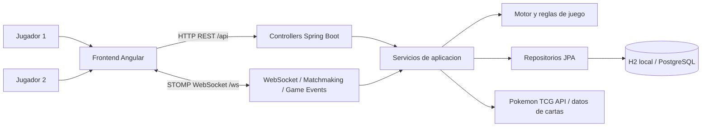
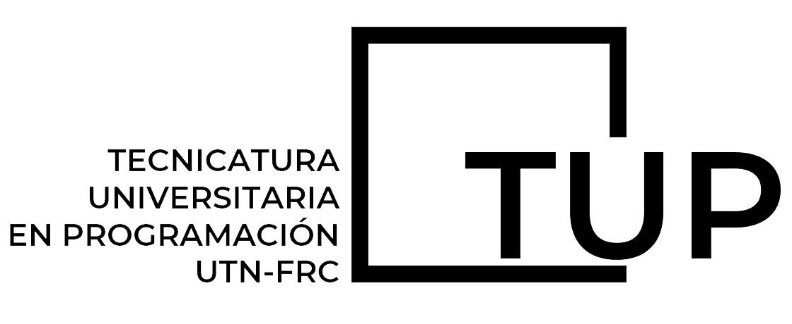

<p align="center">
  
</p>

# Pokemon Trading Card Game

Trabajo Practico Integrador de Programacion III basado en una version digital del juego de cartas Pokemon TCG. El proyecto implementa una arquitectura cliente-servidor con backend en Spring Boot y frontend en Angular para permitir partidas entre dos jugadores, gestion de estado de partida y comunicacion en tiempo real.

## Stack tecnologico

### Backend

- Java 21.
- Spring Boot 3.3.0.
- Maven Wrapper.
- Spring Web, Spring Data JPA, Spring Validation, Spring Security, Spring WebSocket y Actuator.
- Springdoc OpenAPI para documentacion de API.
- H2 en memoria para ejecucion local segun la configuracion actual.
- PostgreSQL y Flyway disponibles como dependencias del proyecto.
- JUnit, Spring Boot Test y JaCoCo para pruebas y cobertura.

### Frontend

- Angular 21.
- TypeScript 5.9.
- npm y Angular CLI.
- RxJS.
- STOMP sobre WebSocket para eventos de partida en tiempo real.
- Tailwind CSS 4 como herramienta de estilos.
- Karma/Jasmine y Playwright como herramientas de testing disponibles.

## Arquitectura general



El frontend concentra la experiencia de usuario, busqueda de partida y acciones del jugador. El backend expone endpoints HTTP, canales WebSocket, persistencia y reglas del juego. La partida se sincroniza mediante snapshots y eventos emitidos desde el backend.

## Requisitos previos

- Git.
- Java 21.
- Node.js y npm.
- IntelliJ IDEA recomendado para desarrollo.

No es necesario instalar Maven globalmente para el backend porque el repositorio incluye Maven Wrapper.

## Instalacion

Clonar el repositorio:

```bash
git clone <url-del-repositorio>
cd tpi-pokemon-2w2-05
```

Instalar dependencias del frontend:

```bash
cd FE
npm install
```

El backend descarga sus dependencias Maven durante la primera ejecucion o prueba.

## Ejecucion local

### Backend

Desde la raiz del repositorio:

```bash
cd BE
.\mvnw.cmd spring-boot:run
```

En Linux o macOS:

```bash
cd BE
./mvnw spring-boot:run
```

Servicios locales principales:

- API backend: `http://localhost:8080`
- Swagger UI: `http://localhost:8080/swagger-ui.html`
- Actuator health: `http://localhost:8080/actuator/health`
- Consola H2: `http://localhost:8080/h2-console`

Configuracion H2 local actual:

- JDBC URL: `jdbc:h2:mem:pokemon_tcg`
- Usuario: `sa`
- Password: vacio

### Frontend

En otra terminal, desde la raiz del repositorio:

```bash
cd FE
npm start
```

La aplicacion queda disponible en:

- Frontend: `http://localhost:4200`

El backend ya permite origenes locales habituales para Angular mediante la configuracion CORS y WebSocket.

## Pruebas y validacion

Backend:

```bash
cd BE
.\mvnw.cmd test
```

Frontend:

```bash
cd FE
npm test
```

Build del frontend:

```bash
cd FE
npm run build
```

## Documentacion tecnica

- Documentacion general del proyecto: [`docs/README.md`](./docs/README.md)
- Auditoria de documentacion: [`docs/DOCUMENTATION_AUDIT.md`](./docs/DOCUMENTATION_AUDIT.md)
- Documentacion del backend: [`BE/docs/README.md`](./BE/docs/README.md)
- Documentacion del frontend: [`FE/docs/README.md`](./FE/docs/README.md)
- Guia de validacion manual del frontend: [`FE/docs/game-manual-validation.md`](./FE/docs/game-manual-validation.md)
- Endpoints y WebSockets del backend: [`BE/docs/endpoints-y-websockets.md`](./BE/docs/endpoints-y-websockets.md)

## Estructura del repositorio

```text
.
|-- BE/                    # Backend Java 21 + Spring Boot
|-- FE/                    # Frontend Angular + TypeScript
|-- docs/                  # Documentacion general del proyecto
|-- documentation-archive/ # Documentacion historica archivada
`-- README.md              # Guia principal del repositorio
```

## Notas de desarrollo

- Mantener documentacion humana en `docs/`, `BE/docs/` y `FE/docs/`.
- No mezclar prompts, reglas operativas o checklists de IA dentro de la documentacion humana.
- Para cambios funcionales, validar backend y frontend segun el stack afectado.
- Para cambios de documentacion, revisar el estado de Git antes de finalizar.

<p align="center">
  
</p>

<p align="center">
  
</p>
